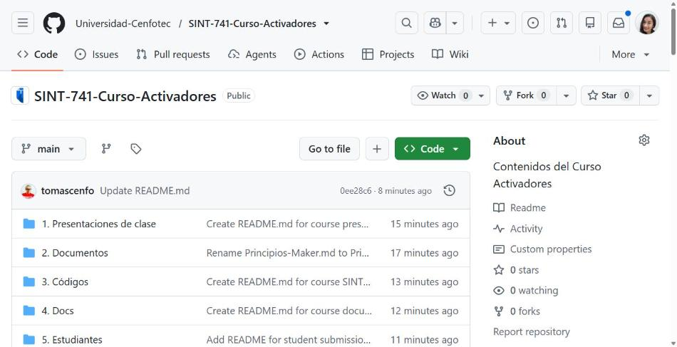
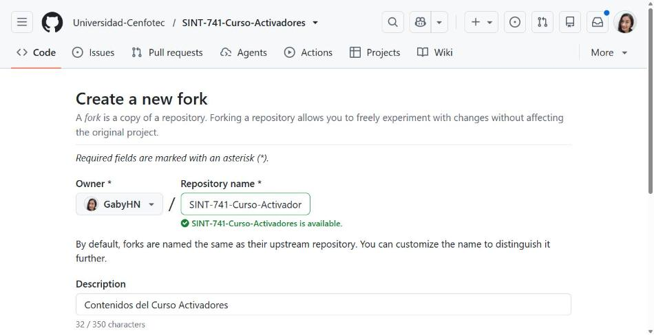
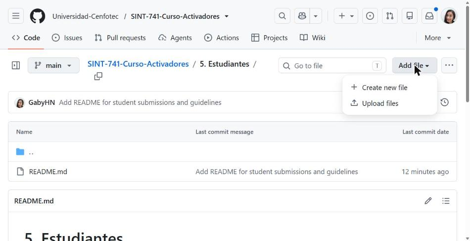
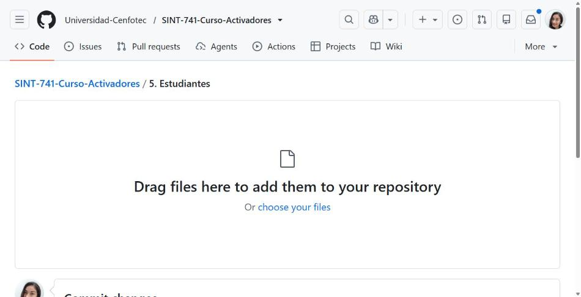
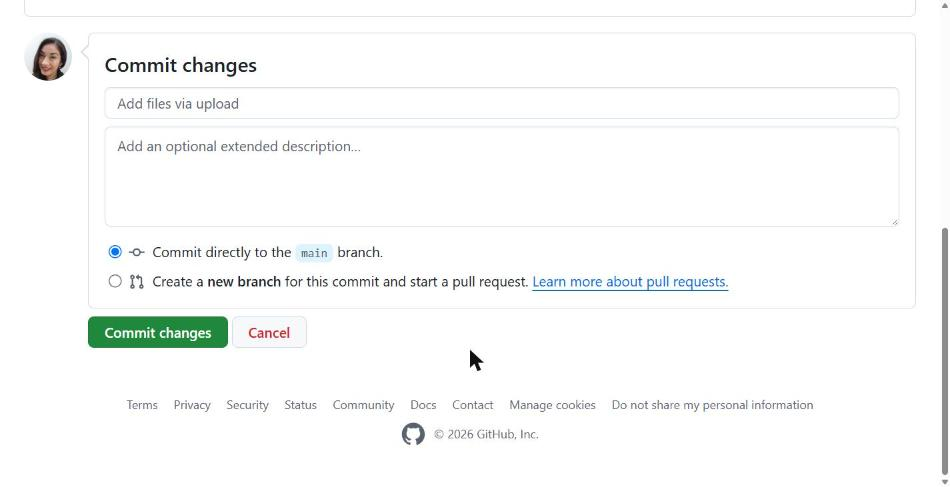
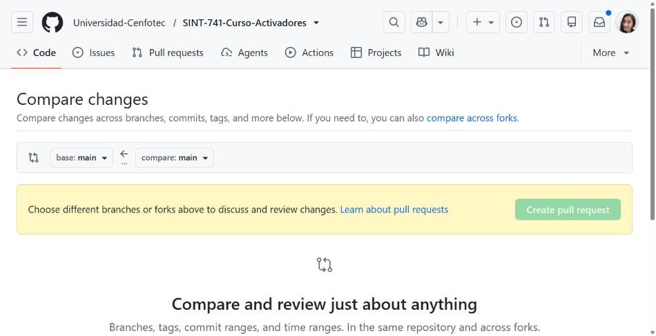

<div align="center">
  
    &nbsp;&nbsp;&nbsp;&nbsp;
      
</div>

---

# Guia para estudiantes: como subir tus trabajos al repositorio del curso

**SINT-741 — Curso Activadores** · Universidad Cenfotec

Esta guia explica, paso a paso, como entregar tus trabajos en el repositorio del curso. Cada estudiante tiene su propia subcarpeta dentro de `5. Estudiantes/` — **el profesor la crea con tu nombre antes de que empieces**. Todo lo que entregues va dentro de esa carpeta.

Hay dos formas de hacerlo. **Empieza por la Parte A**: funciona desde el navegador y no requiere instalar nada. La Parte B es para cuando quieras trabajar con Git desde tu computadora.

---

## Antes de empezar

Necesitas una cuenta de GitHub. Si no tienes, creala en https://github.com/signup (es gratis). Usa un nombre de usuario que te sirva tambien como portafolio profesional, porque va a quedar asociado a tu trabajo. Avisale al profesor cual es tu usuario para que pueda asignarte tu carpeta.

### Como funciona la entrega

No vas a escribir directamente en el repositorio del curso. El flujo es este:

- **Fork** — haces una copia del repositorio del curso en tu propia cuenta.
- - **Cambios** — subes tus archivos a *tu* copia.
  - - **Pull Request** — le pides al profesor que incorpore tus cambios al repositorio del curso.
    - - **Revision** — el profesor revisa, comenta si hace falta, y acepta la entrega.
     
      - Es el mismo mecanismo que usan los equipos de desarrollo en la industria. Aprenderlo es parte del curso.
     
      - ### Tres palabras que vas a ver todo el tiempo
     
      - | Palabra | Que significa |
      - |---------|---------------|
      - | **Fork** | Tu copia personal del repositorio del curso. Puedes hacer lo que quieras ahi sin afectar el original. |
      - | **Commit** | Un cambio guardado, con un mensaje que explica que hiciste. Es un punto en la historia del proyecto. |
      - | **Pull Request (PR)** | La solicitud para que tus cambios pasen de tu copia al repositorio del curso. Ahi ocurre la revision. |
     
      - ---

      ## Parte A — Desde el navegador

      > Recomendado para empezar. No necesitas instalar nada.
      >
      > ### Paso 1. Haz tu fork
      >
      > Entra al repositorio del curso y, arriba a la derecha, haz clic en **Fork**.
      >
      > ```
      > https://github.com/Universidad-Cenfotec/SINT-741-Curso-Activadores
      > ```
      >
      > 
      > *Figura 1. El boton Fork esta arriba a la derecha, junto a Watch y Star.*
      >
      > En la pantalla que aparece, deja todo como esta y haz clic en **Create fork**.
      >
      > 
      > *Figura 2. Pantalla de creacion del fork. El Owner debe ser tu propio usuario.*
      >
      > En unos segundos vas a estar en *tu* copia. Lo notas porque arriba aparece tu usuario, y debajo del nombre dice "forked from Universidad-Cenfotec/...".
      >
      > > **Esto se hace una sola vez en todo el curso.** Para las entregas siguientes ya tienes tu fork listo.
      > >
      > > ### Paso 2. Entra a tu carpeta
      > >
      > > Dentro de tu fork, navega a `5. Estudiantes/` y abre la subcarpeta con tu nombre. Esa es tu carpeta: todo lo que entregues va ahi adentro. No subas archivos fuera de tu carpeta ni modifiques las carpetas de tus companeros.
      > >
      > > ### Paso 3. Sube tus archivos
      > >
      > > Estando dentro de tu carpeta, haz clic en **Add file** y elige **Upload files**.
      > >
      > > 
      > > *Figura 3. Menu Add file, con la opcion Upload files.*
      > >
      > > Arrastra tus archivos a la zona punteada, o haz clic en **choose your files** para buscarlos en tu computadora. Puedes subir varios archivos a la vez, y tambien carpetas completas arrastandolas.
      > >
      > > 
      > > *Figura 4. Zona de carga: arrastra los archivos aqui.*
      > >
      > > ### Paso 4. Guarda el cambio y crea el Pull Request
      > >
      > > Baja hasta la seccion **Commit changes**, al final de la pagina.
      > >
      > > 1. En el campo del mensaje, escribe que estas entregando. Por ejemplo: `Entrega laboratorio 2 - Ana Rodriguez`. Evita mensajes vacios como "cambios" o "update".
      > > 2. 2. Selecciona la segunda opcion: **Create a new branch for this commit and start a pull request**.
      > >    3. 3. Haz clic en **Propose changes**.
      > >      
      > >       4. 
      > >       5. *Figura 5. Elige la segunda opcion, la de crear una rama nueva. Es la que abre el Pull Request.*
      > >      
      > >       6. > **Importante:** El segundo punto es el que permite abrir el Pull Request. Si dejas marcada la primera opcion, el cambio queda solo en tu copia y el profesor no lo recibe.
      > >          >
      > >          > ### Paso 5. Abre el Pull Request
      > >          >
      > >          > GitHub te lleva a la pantalla de comparacion. Verifica arriba que la flecha apunte **desde tu fork hacia `Universidad-Cenfotec/SINT-741-Curso-Activadores`, rama `main`**. Pon un titulo claro, describe brevemente que entregas y haz clic en **Create pull request**.
      > >          >
      > >          > 
      > >          > *Figura 6. Pantalla de comparacion. Revisa bien el origen y el destino antes de crear el PR.*
      > >          >
      > >          > Tu entrega quedo registrada con fecha y hora.
      > >          >
      > >          > ### Paso 6. Que pasa despues
      > >          >
      > >          > El profesor va a revisar tu PR. Pueden pasar tres cosas:
      > >          >
      > >          > - **Lo acepta (merge).** Tus archivos pasan al repositorio del curso. Entrega completa.
      > >          > - - **Te deja comentarios.** Leelos, haz los ajustes y sube los archivos corregidos *a la misma rama*: el PR se actualiza solo, no abras uno nuevo.
      > >          >   - - **Te pide algo puntual.** Responde en el mismo hilo de comentarios del PR.
      > >          >    
      > >          >     - Vas a recibir notificaciones por correo de cada comentario.
      > >          >    
      > >          >     - ### Para la siguiente entrega: actualiza tu fork
      > >          >    
      > >          >     - Antes de empezar un trabajo nuevo, pon tu fork al dia con el repositorio del curso. Entra a tu fork y, si aparece un aviso de que esta desactualizado, haz clic en **Sync fork** y luego en **Update branch**. Si no haces esto, tu copia se va quedando atras y las entregas se complican.
      > > 
      ---

      ## Parte B — Con Git desde tu computadora

      Mas comodo cuando entregas codigo o muchos archivos, y es la forma en que se trabaja profesionalmente.

      ### Instalacion por unica vez

      1. Descarga Git de https://git-scm.com/downloads e instalalo con las opciones por defecto.
      2. 2. Cierra y vuelve a abrir la terminal. Si no, no reconoce el comando.
         3. 3. Verifica la instalacion y configura tu identidad con el mismo correo de tu cuenta de GitHub:
           
            4. ```bash
               git --version
               git config --global user.name "Tu Nombre"
               git config --global user.email "tucorreo@ejemplo.com"
               ```

               ### Preparacion por unica vez

               Haz el fork desde la web (Paso 1 de la Parte A). Luego clona **tu fork** (reemplaza TU-USUARIO) y agrega el repositorio del curso como referencia:

               ```bash
               git clone https://github.com/TU-USUARIO/SINT-741-Curso-Activadores.git
               cd SINT-741-Curso-Activadores
               git remote add upstream https://github.com/Universidad-Cenfotec/SINT-741-Curso-Activadores.git
               ```

               ### El flujo de cada entrega

               **1.** Actualiza tu copia con lo ultimo del curso:

               ```bash
               git checkout main
               git pull upstream main
               git push origin main
               ```

               **2.** Crea una rama para la entrega con un nombre descriptivo:

               ```bash
               git checkout -b entrega-lab-02
               ```

               **3.** Copia tus archivos a tu carpeta dentro de `5. Estudiantes/` usando el explorador de archivos, como con cualquier otra carpeta.

               **4.** Guarda y sube los cambios:

               ```bash
               git add .
               git commit -m "Entrega laboratorio 2 - Ana Rodriguez"
               git push origin entrega-lab-02
               ```

               **5.** Abre el Pull Request. Entra a tu fork en GitHub: va a aparecer el boton **Compare & pull request**. Haz clic, completa el titulo y la descripcion, y crea el PR.

               Si el profesor te pide cambios, corrige los archivos y repite el paso 4 sobre la misma rama. El PR se actualiza automaticamente.

               ---

               ## Reglas del curso

               | Regla | Detalle |
               |-------|---------|
               | Donde van los archivos | Unicamente dentro de tu subcarpeta en `5. Estudiantes/`. Las carpetas 1 a 4 son material del profesor. |
               | Nombres de archivos | En minuscula, separados por guiones, sin espacios, tildes ni enes: `lab-02-informe.pdf`, no `Lab 02 Informe Final(1).pdf` |
               | Un PR por entrega | No mezcles dos trabajos distintos en el mismo Pull Request. |
               | Mensajes con sentido | Que se entienda que hiciste sin necesidad de abrir el archivo. |
               | Lo que no se sube | Carpetas generadas automaticamente (`node_modules`, `venv`), contrasenas, llaves de API o tokens, datos personales de terceros. |

               > **Este repositorio es publico.** Cualquier persona en internet puede ver lo que subes. Revisa siempre tus archivos antes de entregarlos.
               >
               > ---
               >
               > ## Problemas frecuentes
               >
               > | Problema | Que hacer |
               > |----------|-----------|
               > | No veo el boton Fork | Asegurate de haber iniciado sesion en GitHub. |
               > | Subi el archivo pero no aparece en el repo del curso | Es lo esperado: esta en tu fork. Falta el Pull Request (Paso 5) y que el profesor lo acepte. |
               > | "This branch is out-of-date" | Usa **Sync fork** en la web, o `git pull upstream main` en la terminal. |
               > | Me equivoque de carpeta | Abre el archivo en tu fork, haz clic en el lapiz y escribe la ruta correcta en el nombre. GitHub mueve el archivo al guardar. |
               > | Subi algo que no debia | Avisale al profesor de inmediato, **antes** de abrir el PR. Borrar el archivo no alcanza: queda en el historial. |
               > | El PR apunta a la rama equivocada | Verifica que el destino sea `Universidad-Cenfotec/SINT-741-Curso-Activadores` rama `main`. Cambialo en los desplegables de arriba. |
               >
               > Ante cualquier duda, pregunta en clase o abre un *Issue* en el repositorio del curso. Equivocarse aca no rompe nada: todo queda registrado y se puede revertir.
               >
               > ---
               >
               > <div align="center">
                 <sub>SINT-741 Curso Activadores · Universidad Cenfotec · Financiado por SENACYT</sub>
                 </div>
