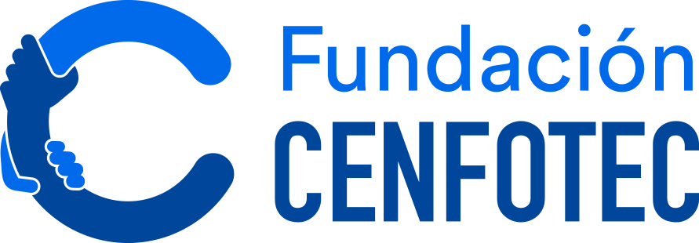
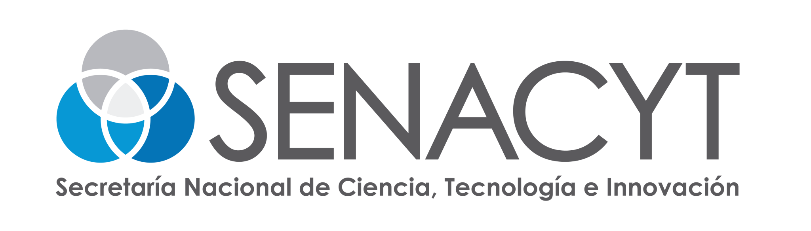

<div align="center">
  
    &nbsp;&nbsp;&nbsp;&nbsp;
      
</div>div>

---

# Guia para estudiantes: como subir tus trabajos

**SINT-741 Curso Activadores** | Universidad Cenfotec

Esta guia explica como entregar tus trabajos en el repositorio del curso. Cada estudiante tiene su propia carpeta dentro de `5. Estudiantes/` — el profesor la crea con tu nombre antes de que empieces. Todo lo que entregues va dentro de esa carpeta.

Hay dos formas de hacerlo. **Empieza por la Parte A**: funciona desde el navegador, sin instalar nada. La Parte B es para cuando quieras trabajar con Git desde tu computadora.

---

## Antes de empezar

Necesitas una cuenta de GitHub. Si no tienes, creala en https://github.com/signup (es gratis). Avísale al profesor tu usuario para que pueda asignarte tu carpeta.

### Como funciona la entrega

| Paso | Que haces |
|------|-----------|
| **Fork** | Haces una copia del repositorio del curso en tu propia cuenta |
| **Cambios** | Subes tus archivos a *tu* copia |
| **Pull Request** | Le pides al profesor que incorpore tus cambios al repositorio del curso |
| **Revision** | El profesor revisa, comenta si hace falta, y acepta la entrega |

### Tres palabras clave

| Palabra | Que significa |
|---------|---------------|
| **Fork** | Tu copia personal del repositorio. Puedes hacer lo que quieras ahi sin afectar el original. |
| **Commit** | Un cambio guardado con un mensaje. Es un punto en la historia del proyecto. |
| **Pull Request (PR)** | La solicitud para que tus cambios pasen de tu copia al repositorio del curso. Ahi ocurre la revision. |

---

## Parte A — Desde el navegador

### Paso 1. Haz tu fork

Entra al repositorio del curso y haz clic en el boton **Fork** arriba a la derecha.

> **URL del repositorio:**
> > https://github.com/Universidad-Cenfotec/SINT-741-Curso-Activadores
> >
> > En la pantalla siguiente, deja todo como esta y haz clic en **Create fork**. En segundos vas a estar en *tu* copia — lo notas porque arriba aparece tu usuario.
> >
> > > **Esto se hace una sola vez en todo el curso.** Para las entregas siguientes ya tienes tu fork listo.
> > >
> > > ### Paso 2. Entra a tu carpeta
> > >
> > > Dentro de tu fork, navega a `5. Estudiantes/` y abre la subcarpeta con tu nombre. Esa es tu carpeta: todo lo que entregues va ahi adentro. No subas archivos fuera de tu carpeta ni modifiques las carpetas de tus companeros.
> > >
> > > ### Paso 3. Sube tus archivos
> > >
> > > Estando dentro de tu carpeta, haz clic en **Add file** > **Upload files**. Arrastra tus archivos a la zona punteada, o haz clic en **choose your files**. Puedes subir varios archivos y carpetas a la vez.
> > >
> > > ### Paso 4. Guarda el cambio y crea el Pull Request
> > >
> > > Baja hasta la seccion **Commit changes** al final de la pagina:
> > >
> > > 1. Escribe un mensaje claro: por ejemplo `Entrega laboratorio 2 - Ana Rodriguez`
> > > 2. 2. Selecciona **Create a new branch for this commit and start a pull request**
> > >    3. 3. Haz clic en **Propose changes**
> > >      
> > >       4. > **Importante:** La segunda opcion es la que permite abrir el Pull Request. Si dejas la primera, el cambio queda solo en tu copia y el profesor no lo recibe.
> > >          >
> > >          > ### Paso 5. Abre el Pull Request
> > >          >
> > >          > GitHub te lleva a la pantalla de comparacion. Verifica que la flecha apunte **desde tu fork hacia `Universidad-Cenfotec/SINT-741-Curso-Activadores`, rama `main`**. Pon un titulo claro, describe brevemente que entregas y haz clic en **Create pull request**.
> > >          >
> > >          > Tu entrega queda registrada con fecha y hora.
> > >          >
> > >          > ### Paso 6. Que pasa despues
> > >          >
> > >          > - **El profesor lo acepta:** tus archivos pasan al repositorio del curso. Entrega completa.
> > >          > - - **Te deja comentarios:** lee, corrige y sube los archivos corregidos *a la misma rama*. El PR se actualiza solo, no abras uno nuevo.
> > >          >  
> > >          >   - ### Para la siguiente entrega: actualiza tu fork
> > >          >  
> > >          >   - Antes de empezar un trabajo nuevo, haz clic en **Sync fork** > **Update branch** en tu fork para ponerte al dia con el repositorio del curso.
> > >          >  
> > >          >   - ---
> > > 
## Parte B — Con Git desde tu computadora

### Instalacion por unica vez

1. Descarga Git de https://git-scm.com/downloads e instalalo con las opciones por defecto
2. 2. Cierra y vuelve a abrir la terminal
   3. 3. Verifica e ingresa tus datos:
     
      4. ```bash
         git --version
         git config --global user.name "Tu Nombre"
         git config --global user.email "tucorreo@ejemplo.com"
         ```

         ### Preparacion por unica vez

         Haz el fork desde la web (Paso 1 de la Parte A), luego clona **tu fork**:

         ```bash
         git clone https://github.com/TU-USUARIO/SINT-741-Curso-Activadores.git
         cd SINT-741-Curso-Activadores
         git remote add upstream https://github.com/Universidad-Cenfotec/SINT-741-Curso-Activadores.git
         ```

         ### Flujo de cada entrega

         ```bash
         # 1. Actualiza tu copia
         git checkout main
         git pull upstream main
         git push origin main

         # 2. Crea una rama para la entrega
         git checkout -b entrega-lab-02

         # 3. Copia tus archivos a tu carpeta en 5. Estudiantes/

         # 4. Guarda y sube
         git add .
         git commit -m "Entrega laboratorio 2 - Tu Nombre"
         git push origin entrega-lab-02
         ```

         Luego abre el PR desde GitHub: aparecera el boton **Compare & pull request** en tu fork.

         ---

         ## Reglas del curso

         | Regla | Detalle |
         |-------|---------|
         | Donde van los archivos | Solo dentro de tu subcarpeta en `5. Estudiantes/` |
         | Nombres de archivos | Minuscula, guiones, sin espacios ni tildes: `lab-02-informe.pdf` |
         | Un PR por entrega | No mezcles dos trabajos en el mismo Pull Request |
         | Mensajes con sentido | Que se entienda que entregaste sin abrir el archivo |
         | Lo que no se sube | `node_modules/`, `.DS_Store`, contrasenas, tokens, datos personales de terceros |

         > **Este repositorio es publico.** Cualquier persona en internet puede ver lo que subes. Revisa siempre tus archivos antes de entregar.
         >
         > ---
         >
         > ## Problemas frecuentes
         >
         > | Problema | Solucion |
         > |----------|----------|
         > | No veo el boton Fork | Asegurate de haber iniciado sesion en GitHub |
         > | Subi el archivo pero no aparece en el repo del curso | Falta el Pull Request (Paso 5) y que el profesor lo acepte |
         > | "This branch is out-of-date" | Usa **Sync fork** en la web o `git pull upstream main` |
         > | Me equivoque de carpeta | Edita el archivo en tu fork, cambia la ruta en el nombre y guarda |
         > | Subi algo que no debia | Avisale al profesor **antes** de abrir el PR |
         >
         > ---
         >
         > <div align="center">
           <sub>SINT-741 Curso Activadores · Universidad Cenfotec · Financiado por SENACYT</sub>
           </div>
