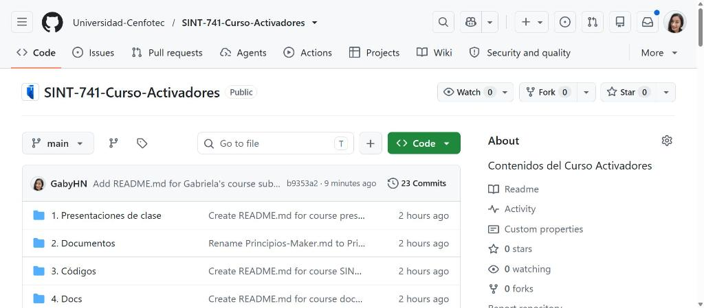
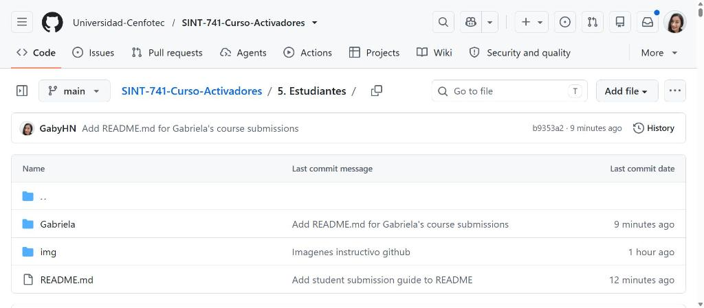
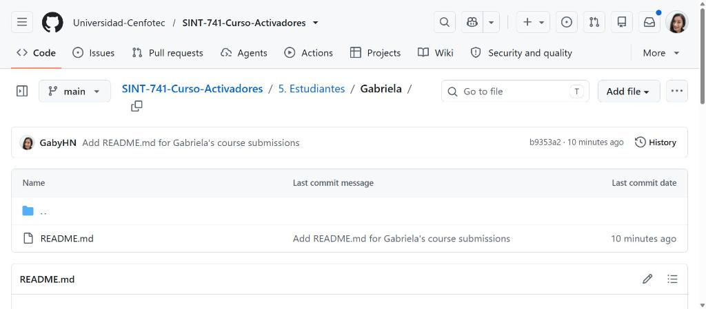
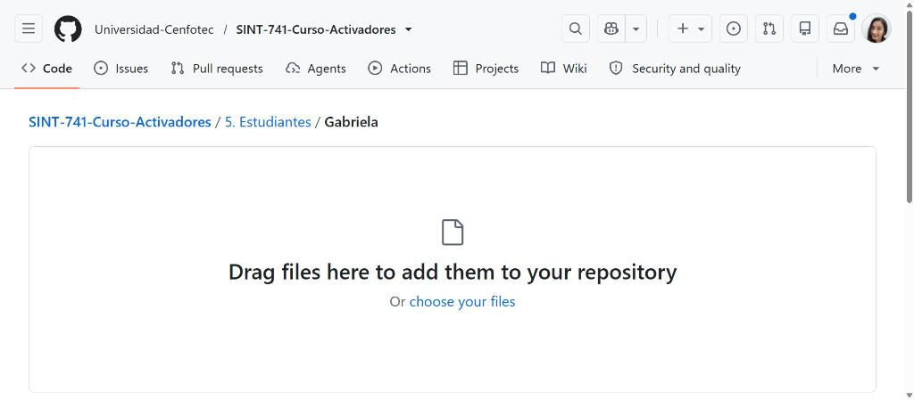
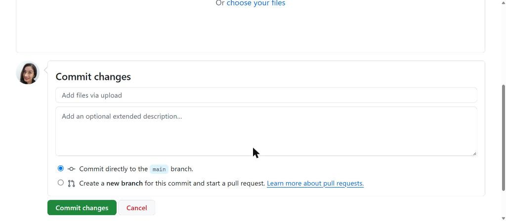

<div align="center">
  
  &nbsp;&nbsp;&nbsp;&nbsp;
  
</div>

---

# Guia para estudiantes: como subir tus trabajos

**SINT-741 — Curso Activadores** · Universidad Cenfotec

> **El profesor crea tu carpeta dentro de `5. Estudiantes/` con tu nombre. Tu solo entras a ella y subes tus trabajos ahi adentro.**

---

## Antes de empezar: 3 palabras clave

| Termino | Que significa |
|---------|---------------|
| **Fork** | Una copia del repositorio del curso en tu propia cuenta de GitHub. Se hace UNA SOLA VEZ al inicio del curso. |
| **Commit** | Guardar un cambio con un mensaje que explica que hiciste. |
| **Pull Request (PR)** | Avisar al profesor que subiste tu trabajo para que lo pueda ver y aceptar. |

**Tambien necesitas:**
- Una cuenta en GitHub — creala gratis en https://github.com/signup
- Avisarle al profesor tu usuario para que cree tu carpeta
- El enlace del repositorio: https://github.com/Universidad-Cenfotec/SINT-741-Curso-Activadores

---

## PASO 1 — Crea tu Fork (solo la primera vez)

Entra al repositorio del curso. Arriba a la derecha ves el boton **Fork**. Hazle clic.



*El boton Fork esta arriba a la derecha, junto a Watch y Star.*

Se abre una pantalla. Deja todo como esta y haz clic en **Create fork**.


*Deja el nombre como esta y haz clic en Create fork.*

En segundos GitHub te lleva a **tu propia copia** del repositorio. Lo notas porque arriba aparece tu usuario antes del nombre del repo.

> **Esto se hace UNA SOLA VEZ en todo el curso.** Para las siguientes entregas tu fork ya existe — ve directo al Paso 2.

---

## PASO 2 — Entra a tu carpeta

Dentro de tu fork, navega a la carpeta **5. Estudiantes**. Ahi ves una subcarpeta con tu nombre.



*La carpeta 5. Estudiantes con la subcarpeta de cada estudiante. Ejemplo: Gabriela.*

Haz clic en tu carpeta para entrar. Solo sube archivos ahi adentro.



*Asi se ve tu carpeta por dentro. Aqui es donde subes todos tus trabajos.*

> **No toques las carpetas de tus companeros.** Cada estudiante solo trabaja en la suya.

---

## PASO 3 — Sube tus archivos

Estando dentro de tu carpeta, haz clic en **Add file** y luego en **Upload files**.



*Zona de carga: arrastra tus archivos aqui o haz clic en choose your files.*

Puedes subir varios archivos a la vez, o carpetas completas arrastandolas.

---

## PASO 4 — Guarda y crea el Pull Request

Baja hasta **Commit changes** al final de la pagina. Sigue este orden:

**1.** Escribe que estas entregando. Ejemplo: `Entrega laboratorio 1 - Tu Nombre`

**2.** Selecciona la segunda opcion: **Create a new branch for this commit and start a pull request**

**3.** Haz clic en **Propose changes**



*Elige SIEMPRE la segunda opcion. Es la que permite que el profesor reciba tu entrega.*

> **Importante:** Si dejas la primera opcion, el cambio queda solo en tu copia y el profesor NO lo ve.

---

## PASO 5 — Confirma el Pull Request

GitHub te lleva a la pantalla de comparacion. Verifica que la flecha vaya **desde tu fork hacia el repositorio del curso, rama main**.

Escribe un titulo claro y haz clic en **Create pull request**.


*Verifica origen y destino, luego haz clic en Create pull request.*

**Listo.** Tu entrega quedo registrada con fecha y hora. El profesor recibe una notificacion automatica.

---

## Que pasa despues de entregar

| El profesor hace... | Tu debes hacer... |
|---------------------|-------------------|
| ✅ Acepta el PR | Nada. Tu entrega esta completa y quedo registrada. |
| 💬 Deja comentarios | Lee los comentarios, corrige tus archivos y vuelve a subirlos a la misma carpeta. El PR se actualiza solo — no abras uno nuevo. |

---

## Para tu siguiente entrega

Antes de subir un trabajo nuevo, sincroniza tu fork:

1. Entra a tu fork en GitHub
2. Si aparece un aviso de desactualizado, haz clic en **Sync fork**
3. Luego haz clic en **Update branch**
4. Repite desde el **Paso 2**

---

## Reglas importantes

| Regla | Detalle |
|-------|---------|
| Donde subes | Solo dentro de tu subcarpeta en `5. Estudiantes/`. Nunca en las de otros. |
| Nombres de archivos | Minuscula y guiones, sin espacios: `lab-01-informe.pdf` |
| Un PR por entrega | No mezcles dos trabajos distintos en el mismo PR. |
| Mensajes claros | Escribe siempre: `Entrega lab-01 - Tu Nombre`. |
| No subir | Contrasenas, tokens, archivos generados automaticamente. |

> **Este repositorio es publico.** Revisa bien tus archivos antes de entregar.

---

## Algo salio mal?

| Problema | Solucion |
|----------|----------|
| No veo el boton Fork | Inicia sesion en GitHub. |
| Subi el archivo pero el profesor no lo ve | Falta el Pull Request (Paso 5). |
| "This branch is out-of-date" | Haz clic en **Sync fork** > **Update branch**. |
| Me equivoque de carpeta | Abre el archivo en tu fork, clic en el lapiz, cambia la ruta. |
| Subi algo que no debia | Avisale al profesor ANTES de crear el PR. |
| PR a la rama equivocada | Verifica que el destino sea `Universidad-Cenfotec/SINT-741-Curso-Activadores` rama `main`. |

---

## Opcion avanzada: Git desde tu computadora

```bash
# Configuracion inicial (una sola vez)
git config --global user.name "Tu Nombre"
git config --global user.email "tucorreo@ejemplo.com"
git clone https://github.com/TU-USUARIO/SINT-741-Curso-Activadores.git
cd SINT-741-Curso-Activadores
git remote add upstream https://github.com/Universidad-Cenfotec/SINT-741-Curso-Activadores.git

# Cada entrega
git checkout main
git pull upstream main
git checkout -b entrega-lab-01
git add .
git commit -m "Entrega lab-01 - Tu Nombre"
git push origin entrega-lab-01
```

Luego entra a tu fork en GitHub y haz clic en **Compare & pull request**.

---

<div align="center">
  <sub>SINT-741 Curso Activadores · Universidad Cenfotec · Financiado por SENACYT</sub>
</div>
